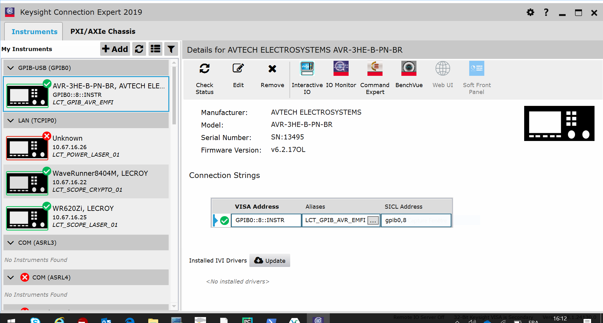

Overview
********

This package encapsulates the access for the AVR deice. It is build on top of visa package and
provide basic function in order to communicate with the device.

Requirements
============
You will need `Python 3+ <https://www.python.org>`_

Installation
============

This tools relies on:

* `VISA <http://www.ivifoundation.org/>`_

This is a standard for configuring, programming, and troubleshooting instrumentation systems comprising GPIB, VXI, PXI,
Serial, Ethernet, and/or USB interfaces. Download VISA environment for your system (NI-VISA, KeySight), and install it.

See `Keysight <https://www.keysight.com/main/software.jspx?cc=FR&lc=fre&ckey=2175637&nid=-33002.977662&id=2175637/>`_.

* `PyVISA <https://pypi.org/project/PyVISA/>`_

A Python package for support of the “Virtual Instrument Software Architecture” (VISA),
in order to control measurement devices and test equipment via GPIB, RS232, Ethernet or USB.

You will need `Python 3+ <https://www.python.org>`_

This package is available under devpi server. So you can install it using pip tools as follow:

.. code-block:: bash

    pip install pyavtech

.. note::

    Refer to initialize pip application note in order to point on internal devpi server.

else you have the ability to install it using wheel distribution package:

.. code-block:: bash

    pip install pyavtech-x.y.z-py3-none-any.whl

.. note::

    Replace x.y.z by the package version number.

Initialize Instrument
---------------------
Once the Keysight environment is installed, launch the 'Keysight Connection Expert application'.
Verify that your device is properly detected by the application. Select the device and give him an alias name.
This alias name will be used by your script to connect to the device.

Package development
===================

The code of the package is developed under :file:`pyavtech` directory.

Convention
----------

If you are developing new features inside the package, please follow `PEP8 <https://www.python.org/dev/peps/pep-0008/>`_

Note that package will be used by other people, so stability matters.

* Follow `PEP20 <https://www.python.org/dev/peps/pep-0020/>`_

.. code-block:: rest

    Beautiful is better than ugly.
    Explicit is better than implicit.
    Simple is better than complex.
    Complex is better than complicated.
    Flat is better than nested.
    Sparse is better than dense.
    Readability counts.
    Special cases aren't special enough to break the rules.
    Although practicality beats purity.
    Errors should never pass silently.
    Unless explicitly silenced.
    In the face of ambiguity, refuse the temptation to guess.
    There should be one-- and preferably only one --obvious way to do it.
    Although that way may not be obvious at first unless you're Dutch.
    Now is better than never.
    Although never is often better than *right* now.
    If the implementation is hard to explain, it's a bad idea.
    If the implementation is easy to explain, it may be a good idea.
    Namespaces are one honking great idea -- let's do more of those!

All necessary packages need to develop are identifed in the requirements.txt file.

After cloning, create a virtual environement, activate it and install necessary package:

.. code-block:: bash

    $ git clone ssh://git@git.ul-ts.com:5022/ims-se/hardware-team/pybench/pyavtech.git
    $ cd pyavtech
    $ python -m python3 -m venv venv
    $ .\venv\Script\activate.bat
    (venv) $ pip install -r requirements.txt

To generate python package in wheel format locally:

.. code-block:: bash

    $ python setup.py bdist_wheel

Documentation and package update
--------------------------------

To generate the documentation, use the following command under docs sub-folder:

.. code-block:: bash

    $ make html
    $ make latex

.. warning::

    To generate latex format, the TeX Live utility must be installed first.

Under root directory you can generate the wheel package and the documentation using the following command:

.. code-block:: bash

    $ python setup.py build_sphinx

finaly you can build wheel package and documentation and the upload to the devpi server using:

.. code-block:: bash

    $ devpi upload --format=bdist_whell --with-docs

.. warning::

    This operation is automatically done using continuous integration at tag creation. Manual operation can be done
    for testing purpose only, but in any case package versioning must be done previously and follow the semantic rules.

References
==========
* `Markdown <https://daringfireball.net/projects/markdown/syntax/>`_
* `Sphinx <https://www.sphinx-doc.org/en/master/>`_
* `PyVISA <https://pypi.org/project/PyVISA/>`_
* `IVI <http://www.ivifoundation.org/>`_
